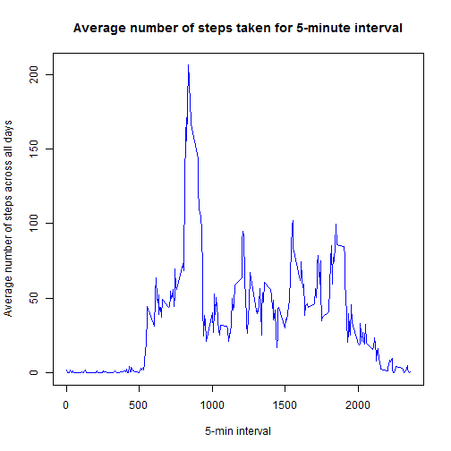

## Settings

```r
library(plyr)
library(lattice)
echo = TRUE ## Echo the codes
```

## Loading and preprocessing the data
* Store unzipped raw file "activity.csv" in the working directory (eg. D:/MH/Data Science Course/dskmh)
* Load the data (i.e. read.csv())
* Process/transform the data (if necessary) into a format suitable for your analysis

```r
setwd("D:/MH/Data Science Course/dskmh")
tab <- read.csv("activity.csv", header=TRUE) #tab contains all records from file
tab1 <- subset(tab, !is.na(steps)) #tab1 contains records without NA values for steps
```

## What is mean total number of steps taken per day?
* Calculate the total number of steps taken per day

```r
sumsteps <- ddply(tab1, "date", summarise, total = sum(steps, na.rm = TRUE))
```

* Make a histogram of the total number of steps taken each day

```r
hist(sumsteps$total, breaks = 20, col = "red", main = "Total number of steps taken each day", xlab = "Number of Steps")
```

 

* Calculate and report the mean and median of the total number of steps taken per day

```r
mean(sumsteps$total)
```

```
## [1] 10766.19
```

```r
median(sumsteps$total)
```

```
## [1] 10765
```

## What is the average daily activity pattern?
* Make a time series plot (i.e. type = "l") of the 5-minute interval (x-axis) and the average number of steps taken, averaged across all days (y-axis)

```r
# calculate average number of steps taken by interval
avesteps <- ddply(tab1, "interval", summarise, mean = mean(steps, na.rm = TRUE))

plot(avesteps$interval, avesteps$mean, 
     type = 'l', 
     main = "Average number of steps taken for 5-minute interval", 
     xlab = "5-min interval", 
     ylab = "Average number of steps across all days",
     col = "blue")
```

 

* Which 5-minute interval, on average across all the days in the dataset, contains the maximum number of steps?

```r
# Find out the maximum figure of all the average steps
max(avesteps$mean)
```

```
## [1] 206.1698
```

```r
# Look for the corresponding interval that has this maximum value
int = avesteps[avesteps$mean==max(avesteps$mean),]
int$interval
```

```
## [1] 835
```

## Imputing missing values
Note that there are a number of days/intervals where there are missing values (coded as NA). The presence of missing days may introduce bias into some calculations or summaries of the data.

* Calculate and report the total number of missing values in the dataset (i.e. the total number of rows with NAs)

```r
tabComplete <- tab[complete.cases(tab),] #tabComplete stores all complete records, i.e. records without NA
tabNA <- tab[!complete.cases(tab),] #tabNA stores all records that contain NA
nrow(tabNA)
```

```
## [1] 2304
```

* Fill in all of the missing values in the dataset. The strategy is to replace missing values (NA) with the mean value for that 5-minute interval (which has been computed and stored in "avesteps"). For instance, in the tabNA dataset, there is a missing value (NA) for steps in the record with date = 2012.10.01, interval = 0. To replace, we will go to avesteps dataset and look for the corresponding mean value computed for the same interval = 0. Then we will use this corresponding mean to replace the NA value for the record in tabNA.

* Create a new dataset that is equal to the original dataset but with the missing data filled in.


```r
#Loop through the tabNA which only contains all records with NA and replace each missing vale with the corresponding mean for that 5-minute interval found in avesteps
for (i in 1:nrow(tabNA)) {
  if (is.na(tabNA[i,1])) {
    x<-tabNA[i,3]                              #identify the interval
    y<-avesteps[avesteps$interval==x,]         #look for the corresponding mean value for steps in avesteps
    z<-y$mean                                  #assign this mean value to variable z  
    tabNA[i,1]<-z                              #replace the missing value in tabNA with value in z
  }
}
#Combine the replaced tabNA with the rest of the complete records in tabComplete to form the new table named Newtab
Newtab <- rbind(tabNA,tabComplete)
```

* Make a histogram of the total number of steps taken each day and Calculate and report the mean and median total number of steps taken per day.

```r
# calculate total number of steps taken by interval for records in the Newtab
sumstepsNew <- ddply(Newtab, "date", summarise, total = sum(steps, na.rm = TRUE))

hist(sumstepsNew$total, breaks = 20, col = "red", main = "Total number of steps taken each day", xlab = "Number of Steps")
```

 

```r
mean(sumstepsNew$total)
```

```
## [1] 10766.19
```

```r
median(sumstepsNew$total)
```

```
## [1] 10766.19
```

* Do these values differ from the estimates from the first part of the assignment? What is the impact of imputing missing data on the estimates of the total daily number of steps?

```r
Diffmean <- mean(sumstepsNew$total) - mean(sumsteps$total) #Difference in mean = 0
Diffmean
```

```
## [1] 0
```

```r
Diffmedian <- median(sumstepsNew$total) - median(sumsteps$total) #Difference in median is positive, i.e.+1.188679 (increase)
Diffmedian
```

```
## [1] 1.188679
```
After the replacement of missing values using the strategy stated above, the mean remains the same(since we replace missing values with computed mean) but the median has increased. 

## Are there differences in activity patterns between weekdays and weekends?
* Use the dataset with the filled-in missing values for this part.
* Create a new factor variable in the dataset with two levels - "weekday" and "weekend" indicating whether a given date is a weekday or weekend day.

```r
Newtab$date <- as.Date((as.character(Newtab$date))) #convert Newtab$date from factor to date format

#default all records to 1, which represents weekday
Newtab$daytype <- 1

#for records with dates that fall on Saturday and Sunday, will assign 2 to daytype
for (j in 1:nrow(Newtab)) {
  if ( (weekdays(Newtab[j,2]) == "Saturday") | (weekdays(Newtab[j,2]) == "Sunday"))
    Newtab[j,4] <- 2
}

#Convert daytype to factor variable 
Newtab$daytype <- factor(Newtab$daytype, labels = c("weekday", "weekend"))
class(Newtab$daytype)
```

```
## [1] "factor"
```

* Make a panel plot containing a time series plot (i.e. type = "l") of the 5-minute interval (x-axis) and the average number of steps taken, averaged across all weekday days or weekend days (y-axis).

```r
# calculate average number of steps taken by interval for records in the Newtab, grouped by interval and daytype
Newavesteps <- ddply(Newtab, .(interval, daytype), summarise, mean = mean(steps, na.rm = TRUE))
xyplot(mean ~ interval | daytype,Newavesteps, type = 'l', ylab = "number of steps", layout = c(1, 2))
```

 

###--End of Assignment--


